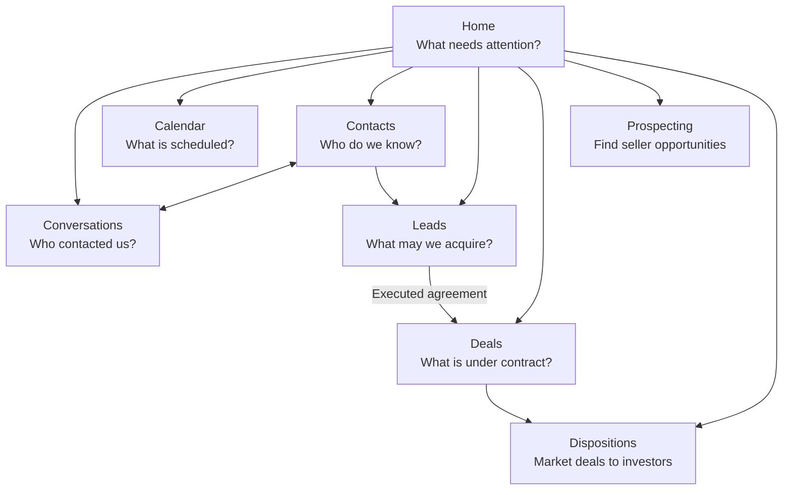

# Global Shell and Home Blueprint

Status: Approved target for future implementation; design only

Blueprint date: September 7, 2026

Companion documents:

- [CRM_NAVIGATION_MODEL_DECISION.md](CRM_NAVIGATION_MODEL_DECISION.md)
- [CRM_TARGET_MENTAL_MODEL.md](CRM_TARGET_MENTAL_MODEL.md)
- [CRM_UX_NAVIGATION_AUDIT.md](CRM_UX_NAVIGATION_AUDIT.md)
- [CRM_UX_NAVIGATION_AUDIT_PLAN.md](CRM_UX_NAVIGATION_AUDIT_PLAN.md)

## Outcome

Stonegate should use one stable operating shell and one clear starting page:

- The shell answers **where does this kind of work live?**
- Home answers **what needs my attention now?**
- Conversations owns communication.
- Calendar owns scheduled time.
- Contacts, Leads, and Deals own records.
- Prospecting and Dispositions own specialized outreach work.
- Finance, Marketing, and Settings remain restricted.

Tasks remain durable records, but employees should not need a separate top-level Tasks concept to determine what to do. Home becomes the workbench over those tasks, approvals, replies, and operational exceptions.

This blueprint does not authorize product code changes. It fixes the target behavior before implementation begins.

## Scope

This blueprint defines:

- Desktop and mobile global navigation.
- Header search, New, Activity, and profile controls.
- Calling and help entry points.
- Home information hierarchy and role variants.
- The future ownership of Tasks, approvals, and notifications.
- Loading, empty, error, and responsive behavior.
- Safe route and data migration boundaries.
- Future implementation slices and acceptance criteria.

It does not define the full internal design of Conversations, Contacts, Leads, Deals, Prospecting, Dispositions, Calendar, or restricted areas. Each receives its own blueprint.

## Current-state diagnosis

### Shell

The current shell is reliable in several important ways: it retains page identity during reconnects, filters destinations by permission, supports keyboard dismissal, and provides a global creation menu. Its conceptual problems are:

- Search only finds workspace names even though its header placement implies global CRM search.
- The notification bell shows a real unread notification count but opens Calendar.
- Approvals has a dedicated header icon even though approvals are a work view.
- Recent destinations has a dedicated icon even though recents naturally belong in universal search.
- A floating Quick Dial button duplicates global and contextual call actions and competes visually with Help.
- Role-based destination filtering can make the basic company map look different between ordinary employees.
- Inbox, Tasks, and Buyers use narrower technical labels than the target concepts of Conversations, Home work, and Contacts.

### Home

The current Home page has useful operational data, but it does not fully own the question “what should I do next?” It currently:

- Presents four summary cards before actual work.
- Builds a priority list independently from the richer Tasks workspace.
- Repeats Inbox, Tasks, and Calendar links already present in the shell.
- Separates “work requiring attention” from “needs intervention” even though both are priority work.
- Shows pipeline pulse to roles for whom it may not support the next action.
- Loads several broad data sources to construct one page.
- Sends many work items to another generic queue instead of the source record where work is completed.

## Target operating map

All ordinary operational employees should recognize the same eight destinations. Permissions change available actions, private fields, and default views; they do not change the company's basic map.



### Target desktop sidebar

```text
STONEGATE HOME BUYERS

WORK
  Home
  Conversations                 [unread]
  Calendar

CRM
  Contacts
  Leads
  Deals

OUTREACH
  Prospecting
  Dispositions

BUSINESS — permissioned
  Finance
  Marketing

ADMINISTRATION — permissioned
  Settings

SIGNED IN AS
  Role / Name
  My setup
```

Rules:

- The current destination has one restrained selected treatment.
- Conversations may show a compact unread count. Other destinations do not become a badge dashboard.
- Destination order stays stable across ordinary roles.
- Finance, Marketing, and Settings render only when permitted.
- No separate Tasks or Buyers destination remains after their replacement destinations are complete.
- During migration, Tasks and Buyers remain visible under their current names until Home and Contacts genuinely support their jobs.
- Sidebar labels do not change merely to make the product appear redesigned.

## Global shell blueprint

### Desktop frame

```text
┌───────────────┬─────────────────────────────────────────────────────────────┐
│ Stable        │ Current page       Search contacts, properties, deals...   │
│ sidebar       │                                      + New  Activity  User │
│               ├─────────────────────────────────────────────────────────────┤
│               │ Reconnect notice, only when needed                         │
│               ├─────────────────────────────────────────────────────────────┤
│               │                                                             │
│               │ Canonical page content                                      │
│               │                                                             │
│               │                                                Help         │
└───────────────┴─────────────────────────────────────────────────────────────┘
```

The shell must render before page data. A failing page panel must not remove navigation, current-page identity, or account controls.

### Header controls

| Control | Target behavior | Current control retired or absorbed |
| --- | --- | --- |
| Page context | Displays the current area and page in plain language | Keeps current context label, but avoids redundant breadcrumbs |
| Universal search | Searches authorized records and destinations | Replaces workspace-only search and absorbs recent destinations |
| New | Creates common cross-workspace records or starts communication | Keeps and expands the current New menu carefully |
| Activity | Opens a personal activity drawer with direct source links | Replaces bell-to-Calendar behavior and absorbs the Approvals shortcut |
| Profile | Account, authentication, and personal setup | Keeps current profile control |
| Help | One floating help control | Keeps Help as the only floating global bubble |

### Universal search

The input label and placeholder should be explicit: **Search contacts, properties, leads, deals, or conversations**.

When the query is empty, the surface shows recent records and recent workspaces. This preserves the value of the current Recent control without requiring another permanent header icon.

When a query is entered, results are grouped in this order:

1. Contacts.
2. Leads and properties.
3. Deals.
4. Conversations.
5. Workspaces and commands.

Search rules:

- Search only data the current user may view.
- Match names, companies, phone numbers, email addresses, property addresses, parcel identifiers, and record titles.
- Results identify type and useful context; “Betty Carroll — Seller — N Brent Dr” is better than “Betty Carroll.”
- Selecting a result opens its canonical record.
- Keyboard arrows move through results; Enter opens; Escape closes and returns focus.
- Requests are debounced and prior requests are cancelled when the query changes.
- A search failure stays inside the search panel with Retry. It does not disturb the page.
- `/` and `Ctrl/Cmd + K` may focus search when they do not conflict with a text field.

### Global New menu

The target menu, filtered by permission, is:

1. Seller lead.
2. Contact.
3. Email.
4. Call.
5. Task.

Context-specific creation remains in context:

- Appointments are created from Calendar or a contact/lead action.
- Deals are created by the executed-contract workflow.
- Disposition cases are created from a contracted deal.
- Investor lists and packets are created inside Dispositions.
- Deal documents are uploaded inside the relevant Deal or Deal & Packet surface.

The menu should not expose system records merely because an API can create them.

### Calling

The floating Quick Dial bubble should be removed after equivalent call entry points are dependable:

- **New → Call** for a number not already in context.
- A consistent **Call** action on a contact, lead, conversation, deal party, or investor.
- A recent-calls or call-history view within Conversations, not a second global launcher.

This removes the current two-bubble ambiguity and reduces accidental use of a global browser-audio path when the employee already has a selected person. Help remains the only floating global control.

### Activity center

The bell opens a right-side drawer on desktop and a full-height sheet on mobile. It never routes directly to Calendar.

```text
ACTIVITY                                      Mark all read
All   Messages   Work   Approvals   System

● New SMS needs a reply                       2m
  Abigail Williamson · Open conversation

● Seller handoff received                    18m
  Marcus Fortner · Open lead

  Purchase agreement delivery failed         1h
  Alicia Cox · Review delivery

View all activity
```

Every activity item contains:

- Category and unread state.
- Plain-language title.
- Contact, record, or source context.
- Timestamp.
- One direct destination.
- Mark read behavior.

The current backend already stores notification type, title, body, entity, direct action URL, read timestamp, and created timestamp. It also routes inbound mailbox notifications to assigned users, assigned teams, alias recipients, watchers, and owner escalation recipients. The Activity center should expose that foundation through a dedicated lightweight list endpoint instead of loading the full acquisition-operations workspace.

Notification ownership rules:

- Conversations owns the shared truth: an authorized employee can see the conversation whether or not that employee received a personal alert.
- Activity owns personal attention: assignment, team membership, watcher settings, notification preferences, and escalation rules determine who is alerted.
- An unassigned inbound message on a company line alerts its configured response team or recipients; it must not rely on one owner noticing it.
- Once assigned, the assignee and non-muted watchers receive the applicable alerts.
- Overdue unassigned replies escalate to operational owners.
- Delivery failures belong to System and link to the exact communication.
- Approvals belong to Approvals and link to the item being reviewed.
- Opening an item may mark it read; answering a message resolves obsolete reply alerts automatically.
- Notification visibility never controls record visibility.

### Mobile shell

At mobile widths:

- The sidebar becomes a focus-trapped navigation drawer.
- The header shows menu, current page, search, New, Activity, and profile without duplicate text labels.
- Search opens a full-width search sheet.
- Activity opens a full-height sheet.
- Navigation and overlay controls restore focus when closed.
- Help remains reachable without covering primary actions.
- There is no horizontally scrolling global header.

## Home blueprint

### Page responsibility

Home owns prioritization, not record editing.

It should tell an employee:

1. What requires action first?
2. Why does it require action?
3. When is it due?
4. Who owns it?
5. Where do I complete it?

Home should not attempt to reproduce every pipeline, calendar, inbox, and dashboard. It should send the employee into the correct canonical context with one click.

### Target desktop layout

```text
HOME                                               Updated just now
Your work requiring attention

My work     Team*     Approvals*                       More ▾
All  Overdue  Due today  Upcoming  Unscheduled

┌───────────────────────────────────────┬──────────────────────────┐
│ PRIORITY WORK                         │ TODAY                    │
│                                       │ 10:00 Seller call        │
│ New SMS from Abigail          Open →  │ 11:30 Property visit     │
│ Reply waiting 12 minutes              │  2:00 Attorney call      │
│                                       │                          │
│ Marcus Fortner follow-up      Open →  │ NEXT                     │
│ Overdue since yesterday               │ Tomorrow · 9:00          │
│                                       │                          │
│ Review purchase agreement    Review → │ TEAM GAPS*               │
│ Approval requested by Devon           │ 2 unassigned replies     │
│                                       │ 1 overdue appointment    │
└───────────────────────────────────────┴──────────────────────────┘

BUSINESS PULSE* — compact, secondary, expandable
Lead flow · Contracts · Deals to market · Closing exceptions

* Permissioned or role-relevant
```

### Page header

The header should contain:

- Title: **Home**.
- One role-aware sentence, such as “Your seller follow-ups, appointments, and replies in priority order.”
- Current scope: **My work** by default; authorized managers may choose **Team** or **Company**.
- Last successful refresh time and a quiet refresh action only when useful.

It should not repeat permanent links to Conversations, Tasks, and Calendar. Those are already in the shell.

### Local views

Primary views:

- **My work:** assigned or personally watched work.
- **Team:** team-owned, unassigned, or delegated work for authorized employees.
- **Approvals:** decisions the employee may make.

Secondary history under **More**:

- Completed.
- AI completed.
- Exceptions.

Filters within the current view:

- All.
- Overdue.
- Due today.
- Upcoming.
- Unscheduled.

Counts act as filters, not as a separate row of large metric cards. A count should only appear when it helps choose work.

### Priority work list

The main list combines actionable records from Tasks, Conversations, appointments, approvals, and operational exceptions. It is ordered by explicit business priority, not merely newest-created time.

Each row includes:

- Work type or source.
- Contact, property, or record name.
- One-sentence reason it needs attention.
- Due time or age.
- Owner when viewing Team or Company scope.
- One primary action.
- A quiet overflow menu only for genuinely secondary actions.

Examples:

| Work item | Reason | Primary destination |
| --- | --- | --- |
| Inbound SMS | Needs reply; waiting 12 minutes | Conversation with that contact selected |
| Seller follow-up task | Overdue since yesterday | Lead communication context |
| Purchase agreement approval | Requested by acquisition rep | Approval review with source evidence |
| Appointment preparation | Starts in 45 minutes | Calendar appointment workspace |
| Packet incomplete | Deal is being marketed; missing approved packet | Deal & Packet for that disposition case |
| Closing exception | Earnest money deadline at risk | Deal closing section |

Simple administrative tasks may be completed inline. Work requiring judgment opens its source record. Home must not turn complex communication, underwriting, packet, or closing work into a checkbox.

### Today's schedule

The right column displays only time-bound commitments relevant to the current employee or selected scope:

- Appointments.
- Scheduled calls.
- Showings or walkthroughs.
- Closing or contract deadlines.
- Explicitly scheduled tasks.

It shows the next few items and links to Calendar for the full schedule. It does not reproduce Calendar dispatch or capacity management.

### Team gaps

Shown only when the employee can act on team work. It lists a small number of actionable gaps:

- Unassigned inbound conversations.
- Unassigned or overdue tasks.
- Appointments without an owner.
- Approvals past target.

Each count opens the already-filtered Team view. It is not a general management dashboard.

### Business pulse

Shown only to owners and relevant managers, below daily work. It is compact and secondary. It may summarize:

- New leads and qualification movement.
- Appointments and offers.
- Executed contracts.
- Deals to market and active buyer interest.
- Closing exceptions.

The employee's actionable work remains above it. VAs and individual contributors should not have to scan executive metrics before their queue.

## Role-aware Home variants

The anatomy stays the same; prioritization and optional secondary panels change.

| Role or job | Default priority work | Right column | Secondary pulse |
| --- | --- | --- | --- |
| VA / prospecting caller | Callbacks, warm handoffs, overdue outcomes, assigned replies | Calls and appointments today | None |
| Acquisition representative | Seller replies, follow-ups, qualification, appointments, offer actions | Seller appointments and scheduled calls | Personal pipeline only when helpful |
| Acquisition manager | Team gaps, SLA exceptions, approvals, capacity | Team schedule | Acquisition pulse |
| Disposition employee | Investor replies, deal follow-ups, packet readiness, offers, deadlines | Investor calls, showings, access | Disposition pulse |
| Transaction coordinator | Closing tasks, documents, deposits, title and attorney deadlines | Closing schedule | Closing exceptions |
| Owner | Personal work first; company exceptions available by scope | Personal or company schedule | Company pulse |
| Finance or marketing staff | Assigned work and applicable deadlines | Relevant scheduled commitments | Permissioned function pulse |

Role changes should never produce a different page grammar. An employee changing jobs should still know how Home works.

## Task and approval ownership

Tasks remain first-class records with assignees, due dates, completion history, approvals, and source associations. Their current capability should be preserved while the navigation concept changes.

### View migration

| Current Tasks view | Target Home location |
| --- | --- |
| My Tasks | My work → All |
| Do Today | My work → Due today |
| Overdue | My work → Overdue |
| Upcoming | My work → Upcoming |
| Unscheduled | My work → Unscheduled |
| Team | Team |
| Approvals | Approvals |
| AI Completed | More → AI completed |
| Exceptions | More → Exceptions |
| Completed | More → Completed |

### Safe route migration

The target Home query contract is:

```text
/os?view=my-work|team|approvals|completed
   &filter=all|overdue|today|upcoming|unscheduled|exceptions|ai-completed
   &item=task:<id>
```

Migration rules:

1. Keep `/os/tasks` and its full current workbench while Home is incomplete.
2. Build Home on the same task workspace records and decision rules; do not create a second task model.
3. Preserve direct selection of `item=task:<id>`.
4. Change generated internal links only after the equivalent Home state exists.
5. Redirect legacy `/os/tasks?...` queries to their Home equivalents only after automated route-compatibility coverage passes.
6. Keep `/os/approvals` compatibility and map it to Home Approvals after that view is complete.
7. Remove Tasks from the sidebar last.

## Route and label migration

| Target label | Safe current route | Migration decision |
| --- | --- | --- |
| Home | `/os` | Keep |
| Conversations | `/os/inbox` | Change visible label before considering a future alias; preserve existing links |
| Calendar | `/os/calendar` | Keep |
| Contacts | Not yet complete | Keep Buyers visible until a genuine Contacts directory exists |
| Leads | `/os/leads` | Keep |
| Deals | `/os/deals` | Keep |
| Prospecting | `/os/prospecting` | Keep |
| Dispositions | Current disposition routes | Keep visible destination; later remove routing ambiguity behind it |
| Tasks | `/os/tasks` | Compatibility route until Home migration is complete |
| Buyers | `/os/buyers` | Compatibility and specialized investor-profile path after Contacts exists |

No bookmark should fail because a navigation label changes. No target label should appear before its destination fulfills the promised job.

## Data contracts and performance

### Home work contract

Home needs a server-filtered, paginated work response rather than full datasets joined in the page. A target item shape is:

```text
id
item_type
source_type / source_id
title / subtitle
reason
priority
due_at / age
owner
action_label / action_url
can_complete_inline
status / tone
```

The server should return only the current scope and page, plus filter counts. The initial page should not fetch full lead, field-operations, executive, and task datasets merely to calculate the first visible rows.

Schedule, Team gaps, and Business pulse may load independently after the priority list so one slower secondary source does not block daily work. Business pulse should be lazy and permissioned.

### Activity contract

The current Notification record already supports the first Activity version. It should receive a dedicated lightweight list endpoint with:

- Cursor pagination.
- Category and unread filters.
- Unread count.
- Mark one read.
- Mark all visible read.
- Existing direct action URLs.

The current `/api/v1/operations/notifications/{id}/read` path remains compatible during extraction.

### Search contract

Universal search requires a permission-aware endpoint that returns small grouped result sets. It should:

- Use normalized phone and email matching.
- Rank exact names and addresses above partial matches.
- Return canonical type, label, context, and URL.
- Enforce organization and record visibility on the server.
- Limit each result group and support an explicit full-results destination later.

## States and recovery

### Loading

- Render the shell and page title immediately.
- Keep layout dimensions stable with a small number of representative row skeletons.
- Load Priority work before secondary panels.
- Do not cover the whole operating system with a loading state.

### Empty

My work empty state:

> You're caught up. Your next scheduled commitment is tomorrow at 9:00 AM.

Team empty state:

> No team work currently needs intervention.

Filters with no result should say that no work matches the filter and offer **Clear filter**. They should not imply the whole company is caught up.

### Error

- Each panel owns its failure and Retry action.
- Previously loaded data may remain visible with a stale timestamp.
- One failed panel does not sign the user out, replace the OS, or require URL editing.
- Authentication or organization failures use the existing shell-level reconnect behavior.
- A failed mark-read or inline completion restores the prior state and explains the failure beside that item.

### Save and refresh

- The current Home view, filter, and scope persist per user.
- Successful inline completion updates the row and counts without reloading the whole page.
- New activity may update the bell count without stealing focus or reordering a row being acted on.

## Responsive behavior

| Width | Home behavior |
| --- | --- |
| 1280 px and wider | Priority work and Today appear in a 2:1 layout; pulse below |
| 768-1279 px | Priority work first; Today and Team gaps stack below or in a narrower side column when space permits |
| Below 768 px | One column; local views and filters wrap or scroll as one compact control strip; rows stack metadata below titles |

Home never becomes a horizontal pipeline board. Dense record boards remain inside the workspace that owns them.

## Accessibility and interaction requirements

- Navigation, search results, tabs, drawers, and work rows are fully keyboard operable.
- The current page and selected Home view are conveyed without relying on color.
- Unread counts have accessible labels and updates use a restrained live region.
- Opening and closing Search or Activity restores focus to the trigger.
- Every icon-only mobile control has a visible tooltip or accessible name.
- Primary actions use specific verbs: **Reply**, **Open lead**, **Review agreement**, **Prepare packet**.
- Status and due language is text, not color alone.
- Reduced-motion preferences are respected.
- A screen reader encounters orientation, views, priority work, schedule, and secondary information in that order.

## What should be removed or merged

After replacements are complete:

- Remove the separate Recent header icon; place recents in Search.
- Remove the separate Approvals header icon; place approvals in Activity and Home.
- Stop routing the notification bell to Calendar.
- Remove the floating Quick Dial button; use New → Call and contextual Call actions.
- Remove repeated Inbox, Tasks, and Calendar actions from the Home header.
- Merge Home's “Work requiring attention” and “Needs intervention” into Priority work.
- Replace large daily metric cards with useful filter counts.
- Move broad Pipeline pulse below role-relevant daily work and hide it when irrelevant.
- Remove Tasks from primary navigation only after Home has full functional parity.
- Replace Buyers in primary navigation only after Contacts is real; keep the investor profile capability.

## Future implementation slices

These are dependency-aware future slices, not authorization to implement them now.

### Slice 1 — Activity center

- Add a lightweight notification list endpoint using the existing Notification model.
- Open the drawer from the bell.
- Support categories, direct links, and mark read.
- Move the Approvals shortcut into the drawer while preserving its route.
- Keep current notification-recipient behavior and add focused delivery tests.

Value: fixes a high-confidence global mismatch without reorganizing records.

### Slice 2 — Home workbench

- Make the existing task workspace the first source of Home work.
- Add My work, Team, and Approvals views plus current filters.
- Point complex items to canonical source records.
- Preserve `/os/tasks` and current links.
- Load schedule and management information independently.

Value: gives every employee one dependable starting point.

### Slice 3 — Universal search and header simplification

- Add permission-aware record search.
- Absorb recent destinations into its empty state.
- Simplify permanent header controls.
- Keep workspace search as a fallback command group during rollout.

Value: reduces navigation memory and makes known records immediately findable.

### Slice 4 — Calling entry-point consolidation

- Verify New → Call and contextual call behavior for internal and outside numbers.
- Preserve call history and recovery states.
- Remove the floating dialer only after parity tests pass.

Value: removes ambiguous global chrome without risking call access.

### Slice 5 — Stable labels and destinations

- Rename visible Inbox to Conversations while preserving `/os/inbox`.
- Complete the Contacts blueprint and implementation before replacing Buyers.
- Remove Tasks from the sidebar only after Home parity and compatibility tests.
- Ensure ordinary staff share the same operational destination map.

Value: completes the intended mental model safely.

## Acceptance criteria

The shell and Home implementation will be complete when:

- An ordinary employee can identify where to find communication, people, leads, contracted deals, seller outreach, and investor outreach from stable nouns.
- The bell opens actionable activity and never implies notifications live in Calendar.
- A known person, phone, email, property, lead, deal, or conversation can be found from the header.
- Home displays the employee's next meaningful work before broad metrics.
- Current Tasks views and deep links have an equivalent Home state before their navigation item is removed.
- Approvals remain complete and auditable.
- Conversations remain company-visible according to authorization even when personal alert routing differs.
- Normal operational roles share the same eight-destination map.
- Finance, Marketing, Settings, sensitive fields, and high-authority actions remain gated.
- Removing a header icon or floating launcher does not remove its capability.
- Slow or failed secondary data cannot break or replace the OS shell.
- Desktop and mobile layouts require no page-level horizontal scrolling.
- Keyboard and screen-reader use can reach every primary action and recover from overlays.

## Score

Scores apply the redesign plan's weighted model and describe the inspected current code versus this target blueprint. The target remains subject to implementation and verification.

### Global shell

| Category | Weight | Current | Target |
| --- | ---: | ---: | ---: |
| Task completion | 30 | 23 | 29 |
| Findability and navigation | 20 | 13 | 20 |
| Language and clarity | 15 | 12 | 15 |
| Cross-page consistency | 15 | 11 | 14 |
| Speed and efficiency | 10 | 9 | 9 |
| Error prevention and recovery | 10 | 9 | 9 |
| **Total** | **100** | **77** | **96** |

### Home

| Category | Weight | Current | Target |
| --- | ---: | ---: | ---: |
| Task completion | 30 | 24 | 29 |
| Findability and navigation | 20 | 15 | 19 |
| Language and clarity | 15 | 12 | 15 |
| Cross-page consistency | 15 | 11 | 14 |
| Speed and efficiency | 10 | 8 | 9 |
| Error prevention and recovery | 10 | 8 | 9 |
| **Total** | **100** | **78** | **95** |

The missing points are intentional. A design cannot honestly receive 100 before implementation, real-data rendering, role checks, performance measurement, and normal production use confirm it.

## Final decision

Stonegate should not become a generic CRM or a collection of role-specific mini-apps. It should use a stable relationship-centered shell, a priority-centered Home, and specialized workspaces only where the real-estate job genuinely requires them.

The next design artifact should blueprint **Conversations and shared communication**, because global Activity, Home reply work, contact context, email attachments, SMS delivery, and calling all depend on a clear communication contract.
