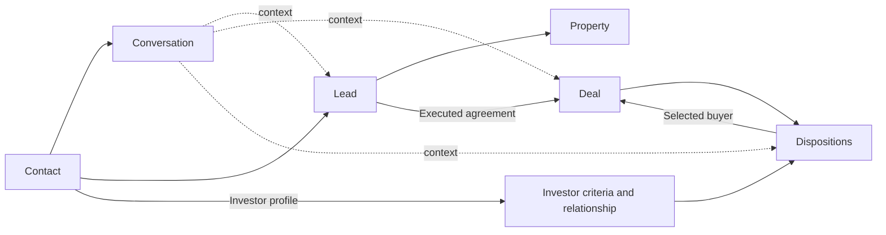

# CRM Navigation Model Decision

Status: Accepted for page blueprinting; not yet implemented

Decision date: September 7, 2026

## Decision

Use a contact-centered, real-estate-specific navigation model.

Stonegate should borrow the clearest structural ideas from GoHighLevel without copying its product, terminology wholesale, visual design, or automation sprawl.

The target ordinary-employee navigation is:

### Work

- Home
- Conversations
- Calendar

### CRM

- Contacts
- Leads
- Deals

### Outreach

- Prospecting
- Dispositions

### Restricted

- Finance
- Marketing
- Settings

Tasks remain a real record type and a complete work view, but become part of Home rather than a separate top-level concept. Investors remain a full relationship capability, but become a prominent contact type and saved view inside Contacts rather than a separate kind of person.

## Why GoHighLevel feels easier

The useful lesson is not its number of menu items. Its common operating model uses familiar, stable nouns:

- Contacts identify people.
- Conversations hold communication.
- Opportunities represent potential transactions.
- Pipelines show opportunity stage.
- Calendars hold scheduled time.

HighLevel describes its core relationship as Contact -> Opportunity -> Pipeline -> Stage. It also uses Smart Lists as saved lenses over the same underlying records instead of creating separate databases for every operational view. See [HighLevel pipelines and opportunities](https://help.gohighlevel.com/support/solutions/articles/155000005062) and [HighLevel Smart Lists](https://help.gohighlevel.com/support/solutions/articles/48001062094-getting-started-with-smart-lists).

HighLevel also preserves context by opening contact and conversation information over an opportunity or appointment instead of forcing a page change. See [HighLevel Contact Overlay](https://help.gohighlevel.com/support/solutions/articles/155000008627-how-to-use-the-contact-overlay-in-highlevel).

Stonegate should adopt those principles:

- Stable nouns in navigation.
- One identity for a person or company.
- Saved views over canonical records.
- Contextual overlays that do not lose the current job.
- Consistent communication behavior across workspaces.

## Why Stonegate should not copy GoHighLevel

Stonegate's transaction is more complex than a generic sales opportunity. One wholesale deal can involve:

- Multiple sellers.
- A property or parcel.
- An acquisition opportunity.
- A purchase agreement.
- Many potential investors.
- Investor offers and backup buyers.
- Attorneys, title companies, and vendors.
- A disposition packet.
- Closing execution.
- Financial reconciliation.

Most importantly, one contracted property is marketed to many investor relationships. That one-to-many workflow deserves a purpose-built Dispositions workspace. It should not be reduced to a generic pipeline or marketing automation.

Stonegate should also avoid:

- A large generic marketing-automation menu.
- Using custom fields as a substitute for real domain records.
- Hiding ordinary company work merely because it is not assigned to the current employee.
- Requiring automation setup to perform ordinary manual work.
- Treating seller prospecting and investor disposition outreach as the same job.

## Models considered

### Model A - Current Stonegate

```text
Home
Inbox
Tasks
Calendar
Prospecting
Leads
Dispositions
Deals
Buyers
Finance
Marketing
Settings
```

Strengths:

- Current capabilities are directly reachable.
- Important specialized workspaces are visible.
- Implementation cost is already paid.

Weaknesses:

- People appear as leads, buyers, conversation contacts, and professionals without one visible directory.
- Home, Tasks, and Calendar compete to answer what should happen next.
- Deals and Dispositions overlap in routing and record ownership.
- Leads contains several peer modes that behave like separate products.
- Role filters can make the CRM structure change dramatically between employees.

### Model B - Lifecycle-specialized Stonegate

```text
Today
Inbox
Calendar
Prospecting
Leads
Deals
Dispositions
Investors
Finance
Marketing
Settings
```

Strengths:

- Closely follows the wholesale lifecycle.
- Gives investor relationships first-class status.
- Removes Tasks as a competing destination.
- Makes post-contract work clearer.

Weaknesses:

- Sellers, investors, and professionals still appear to live in different identity systems.
- Today is less familiar as a stable navigation noun than Home or Dashboard.
- Inbox understates outbound calling and email work.
- Investors remains separated from the general relationship model.

### Model C - Contact-centered Stonegate

```text
Home
Conversations
Calendar
Contacts
Leads
Deals
Prospecting
Dispositions
Finance
Marketing
Settings
```

Strengths:

- Uses nouns that answer predictable questions.
- Gives sellers, investors, and professionals one visible identity model.
- Keeps Lead and Deal as clear property-opportunity lifecycle records.
- Retains specialized seller and investor outreach workspaces.
- Makes saved views filters over records instead of new destinations.
- Matches the strongest parts of the VA's existing CRM intuition.

Tradeoffs:

- Contacts needs a carefully designed directory and association model.
- Investor-specific features must remain prominent rather than becoming buried generic fields.
- Moving Tasks into Home requires a strong Home blueprint.
- Terminology and routes must migrate gradually to preserve bookmarks and user confidence.

## Weighted comparison

These are architecture scores based on the current code, business workflow, existing screenshots, and stated requirements. They are not claims about production usability.

| Criterion | Weight | Current | Lifecycle-specialized | Contact-centered |
| --- | ---: | ---: | ---: | ---: |
| Immediate learnability | 25 | 60 | 82 | 94 |
| Fit with wholesale workflow | 25 | 82 | 94 | 96 |
| Context preservation | 15 | 72 | 86 | 94 |
| Relationship continuity | 15 | 62 | 82 | 95 |
| Permission and collaboration fit | 10 | 62 | 88 | 90 |
| Implementation viability | 10 | 100 | 86 | 84 |
| **Weighted total** | **100** | **72** | **87** | **93** |

Model C is selected because it provides the clearest long-term employee mental model without discarding Stonegate's specialized wholesaling capabilities.

## Repository feasibility

The contact-centered model is supported by the existing domain structure:

- `Contact` already stores organization, legal name, preferred name, contact type, and assigned user.
- `ContactMethod` already stores normalized phone and email identities.
- `Lead` already references both a `Contact` and a `Property`.
- `Conversation` already references a `Contact` and supports lead, transaction, buyer, and general conversation types.
- `ConversationContextLink` already associates a conversation with a lead, transaction, buyer, or disposition case.
- Buyer conversation creation already creates a `Contact` with contact type `buyer`.
- Buyer updates already synchronize the investor identity and contact methods into that contact.
- General professional email and voice flows already create `business_contact` records.

This means a Contacts directory does not require inventing a new identity concept. The interface and service ownership need to be unified, but the core entity already exists.

The current limitation is that the Buyer record still owns much of the investor's duplicated name, company, email, and phone data. The target ownership should gradually become:

- Contact owns identity, communication methods, and person/company-level assignment.
- Investor profile owns markets, buy boxes, strategies, proof, capacity, relationship quality, and performance.
- Lead owns seller-property acquisition context.
- Conversation owns communication history.

That migration does not need to happen in one release.

## Final employee mental model



In employee language:

- A Contact is someone Stonegate knows.
- A Lead is a property Stonegate may acquire from seller contacts.
- A Deal is a property Stonegate has under contract or is closing.
- A Conversation is communication with a contact, sometimes about a lead or deal.
- Dispositions is the work of marketing a deal to investor contacts.

## Navigation question answered by each destination

| Destination | Question it answers |
| --- | --- |
| Home | What needs attention? |
| Conversations | Who contacted us, and what has been said? |
| Calendar | What is scheduled? |
| Contacts | Who do we know? |
| Leads | Which properties are we trying to acquire? |
| Deals | Which properties are under contract or closing? |
| Prospecting | Who are we contacting to find sellers? |
| Dispositions | Which contracted deal are we marketing to investors? |
| Finance | What must be recorded, paid, or reconciled? |
| Marketing | Which acquisition marketing is running and working? |
| Settings | How is the company system configured? |

If an employee cannot answer where a function belongs using this table, the page blueprint is incomplete.

## Contact types and views

Contacts is one directory with prominent saved views:

- All contacts
- Sellers
- Investors
- Professionals
- Needs follow-up
- Recently contacted
- Unassigned

These are views, not separate databases.

Selecting a contact opens a consistent context panel with:

- Identity and communication methods.
- Relationship type or types.
- Owner and next follow-up.
- Recent conversation.
- Associated leads, properties, deals, and disposition activity.
- A path to the full specialized profile when one exists.

An investor still receives a full specialized profile for buy boxes, proof of funds, markets, offers, purchases, and performance. Contacts provides the common identity and relationship doorway; it does not flatten investor data into a generic address book.

## Opportunity terminology

Stonegate should not adopt the word Opportunity as a primary navigation item.

For this company:

- Lead is the familiar pre-contract seller opportunity.
- Deal is the familiar post-contract transaction.
- Dispositions is the familiar investor-marketing job.

Those terms are more precise than a generic Opportunity module. Stonegate should borrow HighLevel's record relationships, not its generic label.

## Task ownership

Tasks remain first-class records but no longer require a separate top-level mental destination.

Home provides:

- My work
- Team work
- Approvals
- Completed history

The full task list can retain its existing route for bookmarks and direct links. Contextual tasks remain visible on Contact, Lead, Deal, Conversation, and Disposition records. Completing a task should return the employee to the source record when further work is required.

## Visibility rule

Ordinary staff share the same eight operational destinations:

- Home
- Conversations
- Calendar
- Contacts
- Leads
- Deals
- Prospecting
- Dispositions

Roles determine:

- Default landing page and saved view.
- Which records are emphasized.
- Which actions are available.
- Which sensitive fields are visible.
- Which approvals or destructive actions are allowed.

Roles should not make the company's basic operating map unrecognizable. Finance, Marketing, Settings, private economics, sensitive evidence, and high-authority actions remain restricted.

## Migration principle

The architecture should be implemented gradually:

1. Define page blueprints and action ownership.
2. Correct global navigation labels and destinations while preserving legacy redirects.
3. Build Contacts as a genuine view of existing Contact identities and associations.
4. Move the full task workbench under Home without breaking direct task links.
5. Standardize the contact/context overlay across Leads, Deals, Calendar, and Dispositions.
6. Consolidate saved views and remove duplicate workspace modes.
7. Remove old visible terminology only after every contextual link has a clear replacement.

No route should be renamed merely for appearance. The destination must first satisfy the meaning of its new label.

## Consequences for page blueprinting

The next blueprint sequence is:

1. Global shell and stable navigation.
2. Home with integrated tasks, notifications, and approvals.
3. Conversations and the shared composer/history contract.
4. Contacts and the context overlay.
5. Leads and the seller acquisition pipeline.
6. Deals and post-contract execution.
7. Prospecting.
8. Dispositions.
9. Calendar.
10. Restricted areas.

No product code should change until the global-shell and Home blueprint specifies how current routes, permissions, notifications, and Tasks will migrate safely.
