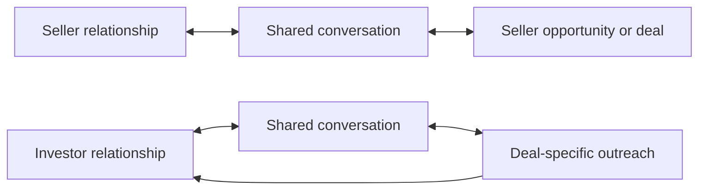

# Stonegate CRM Target Mental Model

Status: Accepted target architecture for page blueprinting; not yet implemented

Created: September 7, 2026

Purpose: Define how Stonegate should make sense to an employee before more pages are redesigned. This document describes product ownership and layout, not the current route implementation.

Navigation decision: [CRM_NAVIGATION_MODEL_DECISION.md](CRM_NAVIGATION_MODEL_DECISION.md)

## The one-sentence model

Stonegate helps the team find opportunities, build relationships, put properties under contract, market contracted deals to investors, and close them - with every conversation, document, deadline, and decision attached to the correct person and property.

## The model employees should learn

Employees should only need to understand three layers:

1. **People:** sellers, investors, and professionals.
2. **Properties:** seller opportunities before contract and active deals after contract.
3. **Work:** conversations, follow-ups, appointments, documents, outreach, and closing actions connected to those people and properties.

The software may use many tables and services behind the scenes. The interface should not require employees to understand them.

## Target business lifecycle

There are two durable relationship loops around that lifecycle:

A conversation is not a separate universe. It is the communication history for a person, optionally in the context of a lead or deal.

## Target top-level navigation

### Work

1. **Home** - everything requiring the current employee's attention.
2. **Conversations** - every seller, investor, and professional conversation.
3. **Calendar** - appointments and scheduled time.

### CRM

4. **Contacts** - the people and companies Stonegate knows, including sellers, investors, and professionals.
5. **Leads** - seller-property opportunities from first interest through executed contract.
6. **Deals** - the canonical post-contract property and transaction record.

### Outreach

7. **Prospecting** - outbound work to find willing sellers.
8. **Dispositions** - market an active deal and work investor interest, offers, and selection.

### Restricted company areas

9. **Finance** - accounting, reconciliation, banking, and compensation.
10. **Marketing** - acquisition marketing, attribution, experiments, and public proof.
11. **Settings** - company configuration, people, integrations, workflows, and policy.

### Structural changes from the current sidebar

- Keep **Home** as the familiar navigation noun, but make the page answer "what needs my attention?"
- Rename **Inbox** to **Conversations** because it owns outbound work and calls as well as inbound messages.
- Absorb the current Tasks destination into Home. Tasks remain records and a complete Home view, but are not a separate mental destination.
- Introduce **Contacts** as the common directory for sellers, investors, and professionals.
- Treat Investor as a contact type with a full specialized relationship profile. A buyer is the investor's role in a particular deal.
- Keep Deals and Dispositions separate because they represent different jobs, but make their boundary explicit.
- Keep Calendar separate because scheduled time is a familiar and durable mental model.

This reduces the ordinary employee model from twelve destinations to eight without removing operating capability.

## Visibility and permissions

The navigation should be stable for ordinary employees. A role changes the default page, default filter, and available actions; it should not make common operating areas appear and disappear unpredictably.

### Company-visible operating areas

All ordinary staff should be able to see:

- Home
- Conversations
- Calendar
- Contacts
- Leads
- Deals
- Prospecting
- Dispositions

This supports the stated requirement that employees can help one another, especially with important disposition work.

Visibility does not automatically grant authority. Permissions still govern actions such as assigning work, exporting, approving offers, executing contracts, sending bulk outreach, selecting a buyer, viewing private economics, deleting records, or modifying company policy.

### Restricted areas

- Finance is visible only to owners and appropriate finance roles.
- Marketing is visible only to owners and appropriate marketing roles.
- Settings is visible only to owners and people with an applicable settings permission.
- Private economics and sensitive documents remain field- or action-restricted even when the operational record is company-visible.

### Role landing pages

| Role | Default landing state |
| --- | --- |
| Owner / executive | Home, Company view |
| Operations assistant | Home, Company work needing coordination |
| Prospecting caller / VA | Prospecting, My Calls |
| Acquisition representative | Home, My seller follow-ups and appointments |
| Acquisition manager | Home, Acquisition team |
| Disposition representative | Dispositions, My active deals and replies |
| Disposition manager | Dispositions, Company view |
| Transaction coordinator | Deals, Closing exceptions |
| Finance | Finance |
| Marketing | Marketing |
| Read-only partner / vendor | Deals, limited assigned or shared records |

These are starting positions, not separate products.

## Canonical ownership rules

| Object or action | Canonical home | Contextual access elsewhere |
| --- | --- | --- |
| Personal and team attention queue | Home | Record pages show their own next action |
| Person or company identity | Contacts | Conversation, lead, deal, disposition, and calendar pages open the same contact context |
| Conversation | Conversations | Contact, lead, deal, disposition, and calendar pages open the same shared conversation |
| Appointment | Calendar | Lead and conversation pages can schedule or open it |
| Seller prospecting batch | Prospecting | Home links to assigned callbacks |
| Seller opportunity before contract | Leads | Conversations, Calendar, Home, Contacts, and Prospecting link to it |
| Underwriting and seller offer | Lead record | Leads views can filter records needing work |
| Executed seller agreement | Lead Contract section until recorded; then Deal Documents | Pipeline can launch either the in-system or existing-signed-contract path |
| Post-contract property / transaction | Deals | Dispositions and Finance reference the same deal |
| Investor relationship profile | Contacts, Investors view | Conversations and Dispositions display the same relationship history |
| Deal-specific investor outreach | Dispositions | Investor profile shows resulting activity |
| Investor packet | Deal Documents as the canonical file; Dispositions Deal & Packet as the working view | Conversations and Outreach can attach or link the approved version |
| Buyer offer and selection | Dispositions | Deal summary displays the selected buyer and status |
| Closing | Deals | Home and Calendar surface deadlines; Dispositions shows relevant status |
| Accounting and reconciliation | Finance | Deal shows permitted operational status without exposing restricted details |
| Company configuration | Settings | Contextual links may open the applicable settings section |

The rule is simple: data can be visible in many contexts, but it should have one authoritative editor and history.

## Workspace contracts

### Home

**Owns:** prioritization, not underlying records.

Home should answer three questions immediately:

1. What needs my attention now?
2. What is due later today?
3. Is anything blocked or unowned?

Target views:

- My work
- Team work, for roles that coordinate others
- Approvals, for roles with approval authority
- Completed, as a secondary history view

Tasks, overdue follow-ups, replies, appointments, and exceptions appear in one ranked list with a clear source label. Selecting an item opens the canonical record or a compact completion panel. Home must not become a second editor for every record type.

### Conversations

**Owns:** communication.

Conversations should contain seller, investor, attorney, vendor, and general company conversations. The conversation layout and send behavior should remain the same regardless of where it was opened.

Target views:

- Mine
- Unassigned
- Team
- Needs reply
- Unread
- Archived

Appointments are metadata or a filter, not a separate communication category unless evidence proves it is needed.

Every outbound item shows:

- Sender and recipient
- Channel
- Timestamp
- Delivery state
- Subject for email
- Attached filenames or linked packet version
- Failure reason and retry path when applicable

### Calendar

**Owns:** scheduled time and availability.

Calendar should focus on:

- Day, week, and agenda views
- Appointments
- Showing and property-access events
- Availability and assignment capacity for authorized coordinators
- Appointment preparation and outcome through the selected event

Unscheduled tasks belong to Home. Calendar should not become the destination for general notifications.

### Contacts

**Owns:** person and company identity, communication methods, relationship type, ownership, and follow-up.

Contacts is one directory with prominent saved views:

- All contacts
- Sellers
- Investors
- Professionals
- Needs follow-up
- Recently contacted
- Unassigned

These are lenses over the same relationship directory rather than separate databases.

The Contacts page should support:

- Search and segmentation
- Relationship owner and priority
- Communication methods and conversation history
- Associated leads, properties, deals, and disposition activity
- Import, merge, archive, and duplicate review

An Investor contact opens a full specialized relationship profile that additionally supports:

- Markets, asset types, buy boxes, and strategies
- Proof of funds and capacity
- Deal interest, offers, purchases, failures, and performance

Target investor sections:

1. Overview
2. Buy boxes
3. Conversations & follow-ups
4. Proof & capacity
5. Deals & performance

Starting a conversation without a deal uses the general contact relationship. Starting from Dispositions automatically carries the selected deal context into the same conversation history. Contact identity remains visible while investor-specific criteria and performance stay in the specialized profile.

### Prospecting

**Owns:** seller cold outreach before a person becomes an active seller opportunity.

For a VA, the first screen is My Calls with:

- Current assigned contact
- Script and relevant property/contact facts
- Call controls
- Outcome
- Callback
- Warm handoff
- The next contact

Managers additionally receive Campaigns, Lists, Assignments, and Performance. Technical dialer health belongs in a manager tool area, not the VA's primary path.

When a prospect becomes a real opportunity, Prospecting creates or links a Lead and clearly confirms the new owner and next action.

### Leads

**Owns:** the seller opportunity from first interest through executed agreement.

The Leads landing page should be one database with:

- Search
- Saved views
- Table or Pipeline display
- Consistent filters
- A selected-lead preview

Lead Queue and Underwriting should become saved views or focused filters rather than separate peer workspaces. The employee should not have to choose among four different definitions of "Leads."

Target lead record sections:

1. Overview
2. Property & valuation
3. Offer
4. Contract
5. Documents & history

Communication and appointments remain immediately accessible but open their canonical shared experiences.

Offer and Under Contract are clickable lifecycle stages. Selecting either launches the appropriate short workflow. Under Contract must offer both:

- Prepare or complete the agreement in Stonegate.
- Record an agreement already signed elsewhere.

House and land follow the same lifecycle and expose the same stage capabilities.

### Deals

**Owns:** the property and transaction after an executed seller agreement exists.

The Deals landing page should organize active transactions around understandable operational views:

- Active
- Needs attention
- Closing soon
- Completed

Readiness, buyer-needed, finance-review, and other system conditions should be filters or status chips unless they represent a genuinely separate job.

Target deal record sections:

1. Overview
2. Contract
3. Closing
4. Documents
5. People
6. Timeline

The Overview shows one clear status strip: purchase contract, packet, investor activity, selected buyer, closing date, and blocking issue. A prominent **Open Dispositions** action enters the deal's marketing workspace. Finance status is visible only to the extent permitted.

### Dispositions

**Owns:** marketing active deals to investors and converting interest into a selected buyer.

The Dispositions landing page should be a deal queue, not another general Deals database. It answers:

- Which contracted deals need marketing work?
- Which investor replies or offers need action?
- Which deadlines or access requests are approaching?

Target deal-marketing workspace:

1. Outreach
2. Deal & Packet
3. Offers & Closing
4. Activity

The Outreach screen should preserve the recently improved free-use model:

- Searchable and reorderable investor queue on the left
- Selected investor and shared conversation in the center
- Canonical relationship summary on the right
- Text, call, and email available without forced sequencing
- Packet open, copy link, text, and email actions immediately available
- Record outcome only when there is something meaningful to save
- No pause/resume session model

Find and rank investors is a list-building action inside the current deal. It can source candidates from:

- Internal Investor Network
- DealMachine API results
- CSV import
- Manual addition

All imported or newly contacted people become canonical Contacts with Investor profiles instead of disposable deal-only contacts.

House and land use the same Outreach, Deal & Packet, Offers & Closing, and Activity capabilities. Asset-specific fields may differ inside a section; entire operational sections should not disappear merely because the property is land.

### Finance, Marketing, and Settings

These areas remain separate because they have different audiences and sensitive authority boundaries. Their future redesign should split large management consoles into clear local sections without exposing them to ordinary staff.

## Global interaction contracts

### Universal search

The header search should search the CRM, not only workspace names. Results should be grouped by:

- Contacts
- Sellers and leads
- Properties and deals
- Investors
- Conversations
- Workspaces and commands

Selecting a result opens its canonical home. The placeholder should state the searchable objects.

### Notifications

The bell should open a real activity center, not Calendar. Notifications should be grouped into:

- Messages
- Assigned work and mentions
- Approvals
- System or delivery failures

Every notification links directly to its source. Conversations should independently show unread counts. Notification delivery preferences determine who is alerted; they do not hide the underlying company conversation from authorized staff.

### Create

The global New menu should remain concise:

- Seller lead
- Contact
- Email
- Quick Dial

Context-specific creation stays in context: add an appointment in Calendar, build an investor list in Dispositions, and upload a deal document in Deals or Deal & Packet.

### Communication

Text, Call, Email, and Note use the same components and status language everywhere. Context changes the suggested draft and linked record, not the fundamental send experience.

### Documents

Every critical document surface identifies:

- Filename
- Document type
- Version
- Uploaded or generated source
- Approval status
- Current / superseded status
- Who added or approved it
- Timestamp

When a file is emailed or texted, sent history identifies whether Stonegate attached the file, inserted a secure link, or did both.

### Status changes

A stage or status is selectable even when it requires more information. The selection opens a short workflow and explains why the fields are required. The UI should not represent a valid business action as an unexplained disabled option.

### Reliability states

Pages keep their shell and record identity during slow API responses. A failed panel displays a local retry state instead of breaking the operating system or forcing the employee to edit the URL. Concurrent users should not invalidate each other's page session.

## Shared page anatomy

Every major workspace should follow this order:

1. **Orientation:** breadcrumb, plain-language title, one-line purpose, and current scope.
2. **Primary action:** no more than one dominant action; one or two quiet secondary actions.
3. **Local navigation:** no more than five visible peer views; uncommon tools move to More.
4. **Work controls:** search, saved view, filters, and display mode in one predictable row.
5. **Main work area:** list or queue; selected record; contextual detail only when useful.
6. **Status and feedback:** local loading, success, error, and save state near the affected action.

### Selected-record layout

For queue-based pages:

- Left: searchable list or queue.
- Center: selected record and primary work.
- Right: concise relationship or readiness context.
- The right panel closes when no record is selected; it must not permanently compress an empty board.
- Primary actions remain visible without scrolling through background detail.

### Visual hierarchy

- Use borders and whitespace to establish structure before adding cards.
- Avoid nested rounded containers and oversized buttons.
- Use one filled primary button per action group.
- Keep secondary metadata quieter than names, statuses, and next actions.
- Empty space should support scanning, not result from columns stretching to the height of one long queue.
- Tables and boards should fit the available viewport and use deliberate horizontal scrolling only when the information cannot reasonably reflow.

## Target cross-workspace handoffs

| From | Action | Destination and preserved context |
| --- | --- | --- |
| Home | Open work item | Canonical contact, lead, deal, conversation, appointment, or disposition record |
| Prospecting | Warm handoff | Lead record with source, conversation, caller notes, owner, and next action preserved |
| Conversations | Open contact | Contact context with seller, investor, or professional relationships visible |
| Conversations | Open related work | Lead, Deal, or Disposition depending on context, with conversation preserved |
| Contacts | Open seller work | Associated Lead or Deal with a clear return path |
| Contacts | Open investor work | Investor profile or deal-specific Disposition activity with context preserved |
| Lead | Schedule appointment | Calendar composer with seller and property prefilled |
| Lead | Move to Under Contract | Contract workflow; on completion opens the new Deal summary with Dispositions available |
| Deal | Market this deal | The deal's Dispositions workspace |
| Dispositions | Open relationship | Investor profile without losing the current deal return path |
| Dispositions | Send packet | Shared composer with the current approved packet and selected investor prefilled |
| Dispositions | Select buyer | Deal updated with buyer, offer, deposit, backup, and closing handoff |
| Deal | Open finance | Restricted Finance context for that deal; ordinary users retain a safe operational summary |

## What should not be unified

- Prospecting and Dispositions should not become one outreach screen. One finds sellers; the other markets a contracted deal to investors.
- Leads and Deals should not become one giant record. The executed contract is a useful lifecycle boundary.
- Deals and Dispositions should not become one giant page. Transaction execution and investor marketing are different jobs.
- Calendar and Home should not become the same page. One owns time; the other owns priority.
- Finance, Marketing, and Settings should not be mixed into ordinary operating screens.

The goal is not to place everything in one workspace. The goal is to make boundaries predictable and handoffs effortless.

## Design sequence from here

Codex should now produce page blueprints in this order:

1. Global shell and stable navigation. Complete in `CRM_GLOBAL_SHELL_HOME_BLUEPRINT.md`.
2. Home with integrated tasks, notifications, and approvals. Complete in `CRM_GLOBAL_SHELL_HOME_BLUEPRINT.md`.
3. Conversations and the shared composer/history contract. Next.
4. Contacts and the context overlay.
5. Leads, Pipeline, Offer, and Under Contract.
6. Deals.
7. Prospecting and VA My Calls.
8. Dispositions and Deal & Packet.
9. Calendar.
10. Restricted company areas.

No employee exercise is required before these blueprints are produced. Existing code, screenshots, business rules, and prior issue reports are sufficient to establish the target architecture. Normal production feedback can refine it later.
