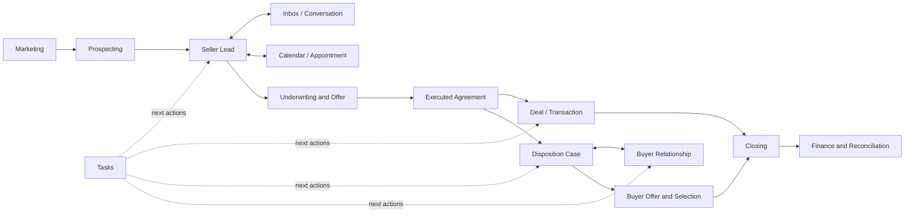
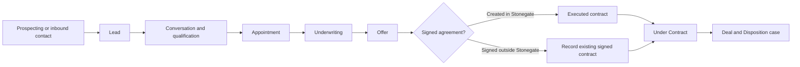
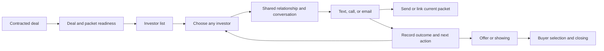
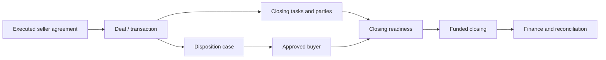

# CRM UX and Navigation Audit

Status: Phase 1 and Phase 2 baseline

Baseline date: September 6, 2026

Companion plan: [CRM_UX_NAVIGATION_AUDIT_PLAN.md](CRM_UX_NAVIGATION_AUDIT_PLAN.md)

## Executive finding

Stonegate does not mainly have a "too many sidebar links" problem. The twelve primary destinations are a reasonable top-level set for the breadth of the business. The larger usability risk is that an employee must understand several overlapping mental models inside those destinations:

- A seller starts as a lead, but communication lives in Inbox, appointments live in Calendar, offer work lives in Leads, and the resulting transaction lives in Deals.
- A contracted deal appears in Deals, the Disposition desk inside Deals, and a dedicated Disposition case with its own Deal & Packet tools.
- An investor exists as a Buyer, a conversation, a disposition queue member, and sometimes an investor relationship row.
- The same next action can appear as a task, a calendar item, a status on a lead, or a prompt inside a specialized workspace.

That structure can be correct technically and still be difficult for a new employee to predict. The next stage of this audit must therefore test complete jobs, not ask whether isolated pages look attractive.

The code also exposes four high-confidence issues that deserve validation before broader aesthetic work:

1. The notification bell displays an unread count but routes to Calendar, while unread conversations are handled in Inbox.
2. Dispositions is represented both as a primary destination and as a specialized view of Deals; this weakens location and ownership cues.
3. Sidebar visibility and API permissions do not always tell the same story for certain employee roles.
4. Land disposition cases deliberately hide some offer, provider, and reconciliation capabilities even though current product direction calls for house and land operational parity.

No production behavior was changed during this baseline audit.

## Evaluation standard

The audit applies the local design system and current code as the product baseline. It also follows established principles that are directly relevant to the reported problem:

- Start with observed user needs, design with evidence, and iterate rather than assuming the first structural answer is correct: [GOV.UK Government Design Principles](https://www.gov.uk/guidance/government-design-principles).
- Organize an application into logical sections and make submenu relationships easy to predict on the first attempt: [W3C guidance on understandable site hierarchy](https://www.w3.org/WAI/WCAG2/supplemental/patterns/o2p02-site-structure/).
- Use clear visual regions and hierarchy so users can understand the purpose and relationship of page areas: [W3C guidance on understandable page structure](https://www.w3.org/WAI/WCAG2/supplemental/patterns/o2p03-page-structure/).
- Give repeated functions consistent names and identification across pages: [W3C Consistent Identification](https://www.w3.org/WAI/WCAG22/Understanding/consistent-identification.html).

Existing architecture, operating-model, design-system, and control-reference documentation remains useful historical context. Where it differs from current routes or behavior, current code is authoritative for this baseline.

## Current operating-system map



This map shows why page-by-page polish alone will not solve the VA's concern. Daily work crosses destinations. Stonegate needs consistent handoffs, terminology, and orientation at each boundary.

## Primary navigation inventory

| Destination | Primary job | Major internal modes | Baseline observation |
| --- | --- | --- | --- |
| Home | Decide what needs attention now | Metrics, priority work, interventions, pipeline pulse | Useful orientation page, but it competes with Tasks and Calendar as the answer to "what do I do next?" |
| Inbox | Continue seller, buyer, and professional conversations | Mine, Unassigned, Team, Needs reply, Appointments, Unread, Archived; SMS, email, call, note | Broad and capable. It is the best existing model for free-form relationship work, but its scope and relationship to notifications require validation. |
| Tasks | Complete assigned and governed work | My Tasks, Do Today, Overdue, Upcoming, Unscheduled, Team, Approvals, AI Completed, Exceptions, Completed | Ten views are powerful but may require employees to understand system taxonomy before acting. |
| Calendar | Schedule and conduct time-based work | Schedule, Dispatch, Appointment, Availability; appointment preparation, walkthrough, seller view, outcome | Combines calendar, dispatch, capacity, and field execution. This may be appropriate for managers but heavy for occasional users. |
| Prospecting | Run seller cold outreach | Campaigns, Dialer control, Analytics, Pilot acceptance, My Calls; campaign and caller subviews | Manager and caller experiences differ substantially. Caller default is appropriately narrow; campaign management is one of the densest areas in the codebase. |
| Leads | Manage seller opportunities through contract | Lead Queue, All Leads, Pipeline, Underwriting; nine saved views; ten stages | One destination contains four distinct work styles. Recent pipeline improvements are visually strong, but first-click behavior and stage-workflow language require task testing. |
| Dispositions | Market contracted deals and manage investor outreach | Deals to Market, Investor Relationships, Replies, Offers, Deadlines, Performance; dedicated case workspaces | Business-critical and appropriately first-class, but it is technically routed through Deals and has another eight-concept case workspace. |
| Deals | Manage active transactions and closing | Seven saved views; queue/table/board; Summary, Contract, Closing, Documents, Parties, Disposition, Finance, Timeline | The record is comprehensive, but Disposition and Finance often act as gateways to other workspaces, creating ambiguous ownership. |
| Buyers | Manage investor relationships and buying criteria | List filters; Summary, Buy boxes, Activity, Proof & capacity, Active deals | Correct strategic direction for an investor relationship CRM. Needs a real investor follow-up task test and tighter linkage to Inbox and Dispositions. |
| Finance | Run accounting, reconciliation, and compensation | Setup, vendors, banking, posting, ledger, reports, tax, reconciliation, revenue, compensation | Sensitive access is appropriate. The page is very broad and loads multiple business systems into a long workspace. |
| Marketing | Manage attribution, experiments, public proof, and performance | Attribution, funnel, web vitals, proof, experiments, exceptions, exports, campaign and Meta measurement | Appropriate to restrict. It currently behaves more like a management console than one focused job. |
| Settings | Configure company policy and integrations | Company, Markets, People, Communications, Integrations, Workflows, Data & Quality, Finance Policy, AI | Permission filtering is appropriate, but section access and sidebar visibility need to remain aligned. |

## Compatibility routes

These routes preserve old links but do not represent separate current destinations.

| Legacy route | Current destination |
| --- | --- |
| `/os/approvals` | Tasks, Approvals view |
| `/os/campaigns` | Prospecting, Campaigns view |
| `/os/lead-manager` | Leads, Lead Queue |
| `/os/pipeline` | Leads, Pipeline board |
| `/os/underwriting` | Leads, Underwriting |
| `/os/transactions` | Deals with the applicable transaction tab selected |
| `/os/operations` | Settings, Prospecting, or Calendar depending on the former tab |
| `/os/operating-model` | Settings, Finance Policy |
| `/os/ai` | Settings, AI & Automation |
| `/os/field-operations` | Calendar |

Compatibility routes are useful for bookmarks. They become a usability problem only if visible controls or documentation continue to use the legacy names.

## Global controls

| Control | Current behavior | Audit question |
| --- | --- | --- |
| Workspace search | Searches available workspace names | Employees may reasonably expect a global CRM search for people, properties, deals, and conversations. Validate the expectation before renaming or expanding it. |
| New | Creates a seller lead, email, or Quick Dial when permitted | Strong consolidation pattern. Confirm that the available actions match each role's daily work. |
| Recent destinations | Reopens recently visited workspaces | Helpful for experienced users; does not teach a new user where a job belongs. |
| Approvals | Opens Tasks filtered to Approvals | Clear destination handoff. |
| Notification bell | Shows unread notification count and opens Calendar | High-confidence mismatch. Message alerts and general notifications should not silently imply that Calendar is the notification center. |
| Profile | Authentication and account controls | No structural concern identified. |
| My Setup | Role manual, workspace test, and manager approval | Valuable onboarding foundation. Its role-manual vocabulary currently includes older labels such as lead manager, VA caller, closer, and dispositions that should be reconciled with current RBAC role names. |
| Green phone bubble | Opens Quick Dial | Useful global access, but an icon-only floating control is easy to confuse with in-context call actions and has recently been associated with reliability problems. |
| Blue help bubble | Opens role-aware help | Useful safety net. Its success should not substitute for predictable primary navigation. |

## Role-to-navigation matrix

This is derived from `apps/web/src/app/os/os-navigation.tsx` and `apps/api/app/domain/rbac.py`. It describes visible sidebar destinations, not every action within those destinations. Owners bypass normal sidebar filtering. Live-account validation is still required because a user may have multiple roles.

Legend: H Home, I Inbox, T Tasks, C Calendar, P Prospecting, L Leads, Dp Dispositions, Dl Deals, B Buyers, F Finance, M Marketing, S Settings.

| Role | Visible destinations from current code |
| --- | --- |
| Owner / Founder-operator / CEO | H, I, T, C, P, L, Dp, Dl, B, F, M, S |
| Administrator | H, T, C, P, L, Dp, S |
| Operations assistant | H, I, T, C, L, Dp, Dl, B |
| Acquisition manager | H, I, T, C, P, L, Dp |
| Acquisition representative | H, I, T, C, L, Dp, Dl |
| Prospecting caller | P, Dp |
| Disposition manager / representative | H, I, T, C, Dp, Dl, B |
| Transaction coordinator | H, I, T, C, Dp, Dl |
| Marketing manager | H, P, Dp, M |
| Finance / accounting | H, I, T, C, Dp, Dl, F |
| Read-only partner / restricted vendor | Dp, Dl |
| AI service identity | No employee sidebar destination |

### Role-access findings to validate

- Acquisition managers receive `deals:view` but the Deals sidebar item does not include their role. They can be authorized for a destination that is not presented.
- Administrators are intentionally broad in company administration but currently do not receive Deals or Buyers permissions. The role name may create a broader expectation than the permission model.
- Prospecting callers receive company-wide Dispositions visibility and therefore see Dispositions next to Prospecting, while Home, Inbox, Tasks, Calendar, and Leads are hidden by sidebar role filters. That does not resemble the most likely VA daily mental model.
- Some non-administrator roles can hold individual settings-related permissions, while the Settings navigation item itself is limited to administrators and owners.
- Company-wide Dispositions visibility matches the current requirement that staff be able to help one another, but each role's edit and private-economics boundaries must remain explicit.

These findings are not a recommendation to broaden sensitive permissions. They are a recommendation to make visible navigation, direct-route access, and employee expectations agree.

## Record ownership and function map

| Record or job | Canonical area | Also surfaced in | Risk |
| --- | --- | --- | --- |
| Seller lead | Leads | Home, Inbox, Tasks, Calendar, Prospecting | Employees may act on the same seller through several task-specific lenses. Every handoff needs a visible seller and next-action context. |
| Conversation | Inbox | Lead detail, Disposition outreach, Buyer record, Quick Dial | Shared history is the right model, but channel actions need the same language and delivery evidence everywhere. |
| Appointment | Calendar | Leads, Inbox, Tasks | Preparation, scheduling, and outcome are split across contexts. |
| Offer / Under Contract | Leads, Valuation & Offer and Contract & Deal | Pipeline stage controls, Tasks, Deals | Controlled workflows are appropriate, but the stage selector must explain and launch the required action instead of looking disabled. |
| Deal / transaction | Deals | Leads, Dispositions, Finance | Deals should remain the canonical post-contract record even when specialized desks own daily work. |
| Disposition case | Dispositions | Deals, Buyer records, Inbox | The relationship between the desk, case, and deal should be explicit in titles and navigation. |
| Buyer / investor relationship | Buyers | Disposition queue, Inbox | High-value relationship history should remain canonical even when an employee contacts the buyer from a deal. |
| Document / packet | Deal and Disposition case | Lead contract area, conversation attachment flows | Users need one visible answer to "what is the current approved file and did it send?" |
| Task / next action | Tasks | Nearly every operational record | Duplicate-looking next actions should identify their source record and authoritative owner. |
| Financial record | Finance | Deal and Disposition reconciliation | Sensitive details should remain restricted without hiding ordinary operational status. |

## Core workflow maps

### Seller acquisition



The user's desired CRM behavior is supported by the second contract path: real-world work can be recorded after the fact without fabricating earlier in-system steps. The pipeline should expose that path clearly for both house and land leads.

### Investor outreach and relationship management



This is the product's strategic center. The recent Outreach Desk work correctly moved toward a free-use conversation model rather than a rigid automated sequence. Remaining work should improve orientation and handoffs without reintroducing forced progression.

### Contract-to-closing



## Cross-workspace handoff risks

| Handoff | Current risk | Desired orientation cue |
| --- | --- | --- |
| Prospecting to Leads | A caller may work assigned contacts without seeing Leads or Inbox in the sidebar. | Show where the handoff went, who owns it, and what the caller should do next. |
| Notification to conversation | Bell count implies a notification center but opens Calendar. | Route each alert to an intelligible notification list or directly to its source record. |
| Lead to Offer / Under Contract | Stages look like ordinary pipeline values but launch governed workflows. | Keep stages clickable and explain the short required action in the same interaction. |
| Under Contract to Dispositions | Deal, transaction, and disposition records are created together. | Confirm all records created and provide one primary next action based on role. |
| Disposition desk to case | Dispositions is both a Deals view and a dedicated route. | Use consistent breadcrumbs and labels: Disposition desk -> Deal -> Outreach/Packet/Offers. |
| Disposition to Buyer | Queue contact is a deal-specific action on a canonical investor relationship. | Keep relationship history visible and make the full buyer profile an obvious secondary destination. |
| Packet to text/email | File identity, version approval, link, attachment, and delivery are separate facts. | Display the exact packet version and whether it was linked or attached in sent history. |
| Deal to Finance | Operational status and private economics share record context but have different audiences. | Expose ordinary closing status broadly while gating private numbers and accounting controls. |

## Preliminary findings and priority

### P1 - Resolve before broad aesthetic work

1. **Notification destination mismatch.** The global bell uses a notification count but opens Calendar. This is especially relevant because Austin receives inbound SMS notifications while Devon and Alex reportedly do not. Delivery fan-out is a separate reliability issue; the navigation target is a discoverability issue.
2. **Dispositions ownership ambiguity.** The sidebar calls the destination Dispositions, the route is a Deals view, and work continues on a dedicated Disposition case route. Users should not need to understand implementation history to know where they are.
3. **Role and navigation mismatch.** The current visible destinations for acquisition managers, prospecting callers, administrators, and settings-capable roles deserve task-based validation and likely correction.
4. **House and land disposition parity.** The dedicated case excludes Offers, External distribution, and Reconciliation for land. This conflicts with the stated business requirement that both asset classes share operational capabilities unless a difference is legally or economically necessary.
5. **Critical document confidence.** Contract and packet surfaces must show the actual attached file and delivery evidence. A user should not have to infer from an email body that the promised PDF was included.

### P2 - Validate in the first workflow rounds

1. **Too many internal modes without an employee-level map.** Leads, Tasks, Calendar, Prospecting, Deals, and Dispositions each contain multiple workspaces or saved views.
2. **Global search expectation.** "Search workspaces" accurately describes the current control, but its global placement creates a reasonable expectation that it searches CRM records.
3. **Three competing daily-work answers.** Home, Tasks, and Calendar all help answer "what should I do next?" Their distinct purposes need to be obvious in onboarding and cross-links.
4. **Mixed relationship terminology.** Buyer, investor, buyer network, investor relationship, and disposition contact describe related concepts. The words may be valid in context but need a documented hierarchy.
5. **Floating phone and help actions.** These are accessible everywhere but visually detached from record context. Confirm that new users can distinguish general Quick Dial from a call tied to the selected seller or investor.
6. **Large management consoles.** Finance, Marketing, manager Prospecting, and lead detail are structurally dense. Their access is restricted, but density still affects training and performance for the people who use them.

### P3 - System-wide refinement after task failures are addressed

- Align breadcrumbs, page titles, selected-record labels, and back destinations.
- Normalize repeated button language and placement.
- Normalize loading, empty, error, success, reconnecting, and permission states.
- Recheck responsive layouts and keyboard paths at the design-system breakpoints.
- Remove obsolete visible terminology once compatibility routes no longer need it.

## Preliminary page scorecard

These scores are triage baselines, not final grades. Repository evidence can establish functional breadth and structural risk, while supplied screenshots help assess hierarchy and density. The most important 30 points - observed task completion - cannot be awarded confidently until the intended role performs a defined task without coaching. Confidence therefore matters as much as the number.

| Area | Baseline | Evidence confidence | Primary reason |
| --- | ---: | --- | --- |
| Home | 80 | Medium | Clear overview, but overlaps Tasks and Calendar as the daily starting point. |
| Inbox | 76 | Medium | Strong communication capability; broad scope and notification behavior need real-user proof. |
| Tasks | 74 | Low | Comprehensive but divided into as many as ten views. |
| Calendar | 72 | Low | Combines schedule, dispatch, field execution, and availability. |
| Prospecting - caller | 75 | Low | Focused default workbench, but surrounding navigation for callers is unusual. |
| Prospecting - manager | 65 | Low | High control density and several nested management modes. |
| Leads - database and pipeline | 84 | High | Recent screenshots show stronger hierarchy and a usable board; governed stages remain a learning point. |
| Leads - queue | 72 | Low | Another full operating mode whose distinction from Tasks and Inbox needs observation. |
| Lead record | 68 | Medium | Seven tabs and extensive asset-specific valuation, offer, contract, and file tooling. |
| Disposition desk | 82 | High | Clear company queue after recent refinements; Deals/Dispositions identity still overlaps. |
| Disposition outreach | 87 | High | Strong free-use investor selection and conversation model after recent iterations. |
| Deal and packet | 72 | Medium | Critical capabilities exist, but upload reliability and packet identity have caused real confusion. |
| Deals | 67 | Low | Seven queue views and eight record tabs span transaction, disposition, finance, and documents. |
| Buyers | 72 | Low | Strong data model, but relationship follow-up navigation has not yet been user-tested. |
| Finance | 61 | Low | Many accounting systems share one long page; access is appropriately restricted. |
| Marketing | 68 | Low | Dense management console with several distinct measurement and publishing jobs. |
| Settings | 74 | Low | Logical section list; permission-to-navigation alignment needs validation. |

## How to decide: simplify, unify, or keep separate

Use these rules during implementation:

### Simplify

Simplify when one employee has one goal but must interpret multiple panels, statuses, or controls before acting. Remove or defer secondary information; do not remove evidence needed for the decision.

### Unify

Unify when the same role performs the same action on the same underlying record in two places and cannot predict which location is authoritative. Unification may mean one canonical editor with contextual links, not necessarily one giant page.

### Keep separate

Keep workspaces separate when they serve genuinely different roles, time horizons, or sensitive data boundaries. Connect them with clear record identity, status, and a purposeful next action.

### Rename or relocate

Rename or relocate when a capability is sound but the employee's natural first guess differs from its current label or destination. Observed first clicks are the evidence for this decision.

## Prioritized real-user evidence queue

The first tests should target daily employee confusion and business-critical handoffs rather than start with another styling pass.

| Order | Role | Uncoached task | What it tests |
| ---: | --- | --- | --- |
| 1 | VA / prospecting caller | Sign in, find the next assigned seller callback, place the call, record the outcome, and identify what happens next. | Default route, visible navigation, My Calls, task language, call reliability, handoff clarity. |
| 2 | Devon or Alex | Find a newly received SMS, open the correct conversation, reply, and confirm ownership or next follow-up. | Notification delivery, notification destination, Inbox filters, assignment, reply confidence. |
| 3 | Austin or Devon | Find the contracted Ringgold deal, choose a specific investor, contact them, and send the current packet while remaining in the conversation. | Dispositions entry point, investor selection, relationship context, packet identity, attachment/link evidence. |
| 4 | Austin | Starting from Pipeline, record a house contract and a land contract that were already signed outside Stonegate. | Clickable Under Contract behavior, asset parity, record creation confirmation. |
| 5 | Transaction coordinator or Austin | Find the attorney conversation, send a purchase agreement PDF, and verify from Sent history that the PDF was attached. | General professional email, attachment evidence, document retrieval, trust. |
| 6 | Devon or Alex | Find an existing investor, review the relationship, contact them about a different deal, and set a follow-up. | Buyers versus Dispositions versus Inbox ownership. |
| 7 | Austin | Find a closing exception and determine the one action and owner required to clear it. | Deals, Tasks, Calendar, and role handoff. |

## Evidence packet template

Use this block for each test:

```text
User / role:
Task result requested:
Starting page:
First control they expected:
First control they used:
Completed without help: Yes / No
Approximate time:
Hesitations or wrong turns:
Unexpected loading, error, or missing access:
What the user called the feature in their own words:
Screenshot or recording:
```

Screenshots should include the full browser window, selected navigation item, visible URL, and any drawer, modal, error, or loading state involved. A short recording is more valuable than many screenshots when the problem is uncertainty about where to click.

## Repository complexity indicators

Static source size is not a usability score, and controls counted in source are not necessarily rendered together. These figures only identify areas that deserve extra observation.

| Area | TSX files reviewed | Approximate TSX lines | Approximate static control references |
| --- | ---: | ---: | ---: |
| Inbox | 8 | 5,688 | 136 |
| Prospecting | 10 | 8,498 | 179 |
| Leads workspace | 9 | 2,379 | 78 |
| Lead-detail supporting components | 31 | 12,151 | Not compared because component scope differs |
| Dispositions | 14 | 8,276 | 331 |
| Deals | 5 | 1,513 | 52 |
| Buyers | 4 | 1,213 | 119 |
| Tasks | 2 | 888 | 21 |
| Calendar / field operations | 4 | 2,872 | 150 |
| Finance | 8 | 2,975 | 155 |
| Marketing | 4 | 1,312 | 51 |
| Settings | 15 | 1,345 | 32 |

The useful conclusion is not that larger files are automatically worse. It is that Dispositions, Prospecting, lead detail, Inbox, and Finance combine enough behavior that real-user task traces are necessary before reorganizing them.

## Phase status and next action

- Phase 1, codebase inventory: complete for the current baseline.
- Phase 2, preliminary usability audit: complete for the current baseline.
- Phase 3, real-user evidence: ready to begin.
- Production changes: none in this audit pass.

The next action is the VA caller test listed first in the evidence queue. Record the attempt without coaching if practical. That result will determine whether the first implementation slice belongs in global navigation, Prospecting / My Calls, task terminology, notification routing, or a combination of those areas.
